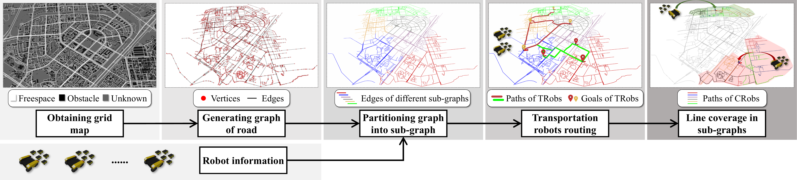

# BLC-LargeScale

## News

The algorithms are described in the following paper. This paper is currently under review and the code will be released after acceptance. 

> Balanced Line Coverage in Large-scale Urban Scene.

## Overview

This paper studies heterogeneous multi-robot performing line coverage in large urban scene, and considers the workload balance between different robot teams and different robots within a team.

## Dataset

There are two types of map, grid map and vector map. 

* The grid map is obtained from Tencent Location Services, and uses generalized voronoi diagram(GVD) to represent the map. 
* The vector map is obtained from Openstreetmap, which can be used directly.

## Requirements

## Installation  and Running

## Acknowledgement

